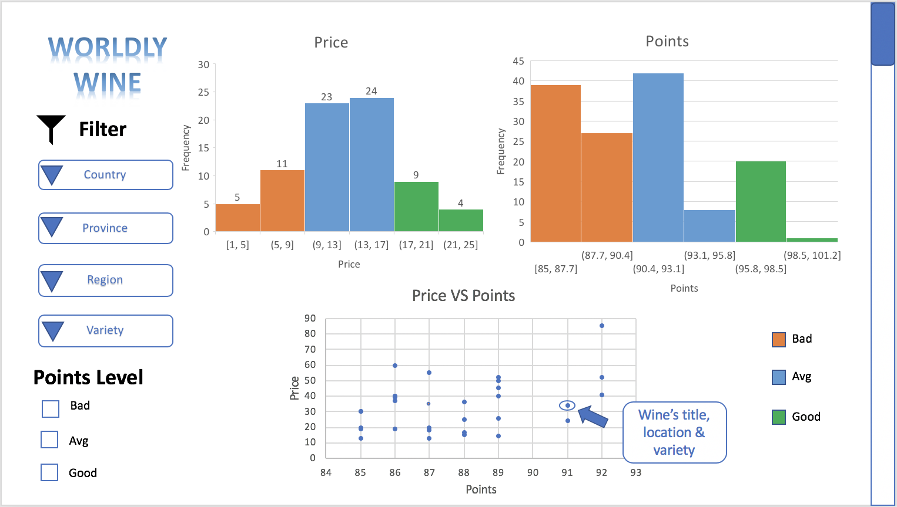

# Milestone 1 - Proposal

## Overview

When choosing a bottle of wine the region and variety can impact quality and price; liquor stores typically have wines sorted by country or region. Understanding the distributions of quality and price could help an average person or sommelier choose a country or region that fits their needs resulting in a better wine choice.  We propose building a shiny app that filters wines by country and region, which then shows related price and score distributions. In addition, a cross plot with hover capabilities will show price versus quality ratings and on hover will display more information about individual wines.

## Description of the data
We will be visualizing a dataset of approximately 130,000 wine reviews. Each wine review has 14 associated variables including variety, location, winery, price, description and review details. Based on our purpose, we will only look at these 6 variables that describe the wine’s location (country, province), the rating of the wine on a scale of 1-100 (points), the cost of a bottle of the wine (price), the type of grapes used to make the wine (variety). By using the data, we will also derive a new variable representing the level of points of a wine (points level). There are three level of the variable, points level: bad (points < 86), average (86 <= points <= 91), and good (points > 91).

## Usage scenario & tasks
Katie is hosting an Argentinian themed dinner party and wants a well rated wine within a certain price range to pair with her Asado and Empanadas.  She uses the "Worldly Wines" app to filter the wine database down to Argentinian wines and is able to view the price and points distribution for all of the wines available.  She then further drills down to wines from the Mendoza Province, and only selects wines that have a "Good" point distribution.  Katie can see from the variety filter that there are quite a few varieties in this region, but decides on a Malbec and further filters the selection.  She then hovers over the cross plot with the remaining wines in her price range with a good points distribution.  The hover information tells her the name of the wine and other relevant information.  Armed with this knowledge, she is now prepared to go to the liquor store and retrieve the wine for her dinner party.

## Description of the app & sketch
On the main page of the app there are two parts: on the left side is the dropdown list, and the right side are the visualizations. From the dropdown list, a user can filter out variables by location (i.e. US, California), by region (i.e. Napa Valley) and by variety (i.e. Pinot Noir). Based on different filters, users will see price and rating visualizations. This includes one price distribution graph coloured by points level, one histogram that displays the points distribution coloured by points level, and one scatter plot whose single point represents a wine with price and points in each axis. When clicking or hovering on each point, the user is able to see its title, variety and other information. Lastly, user has the option to view all the wines at a specific quality category.

