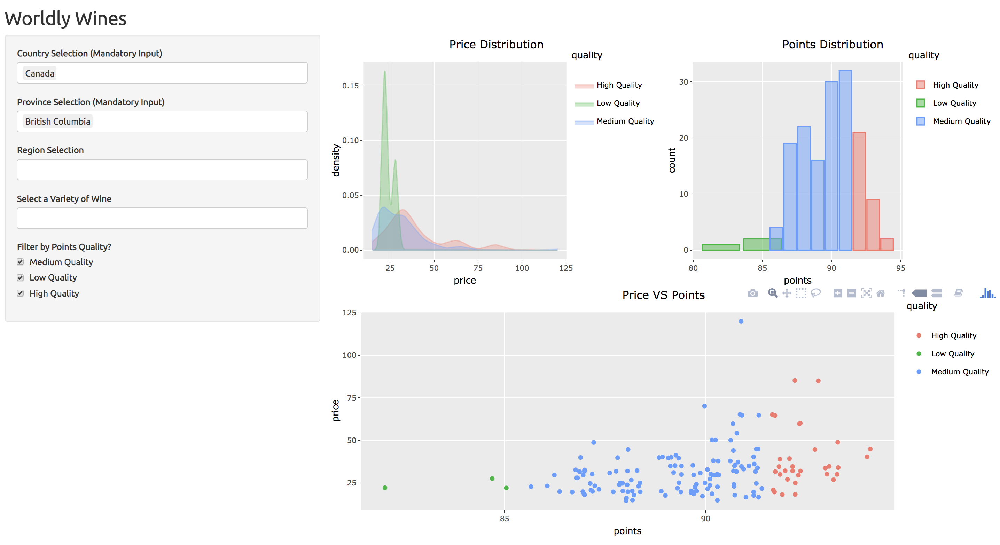
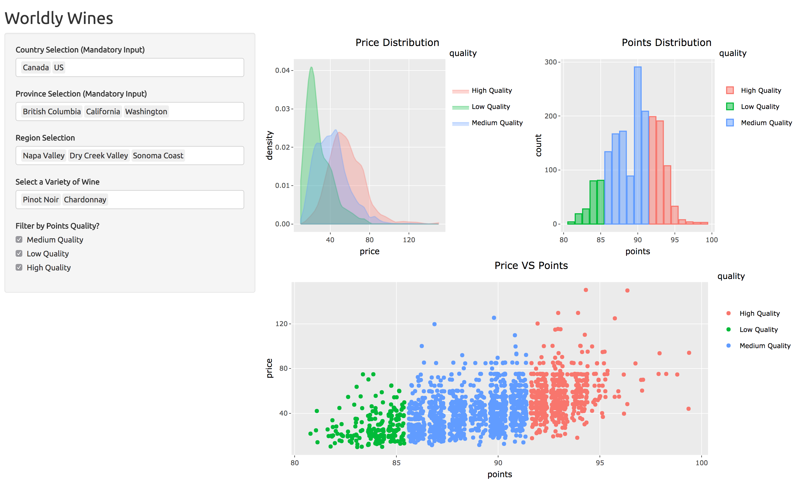
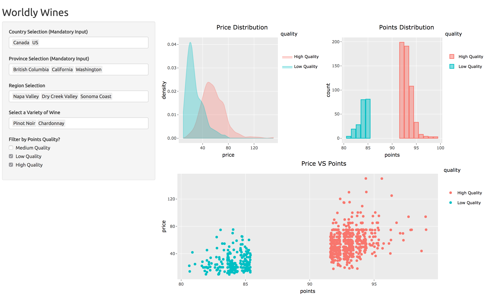
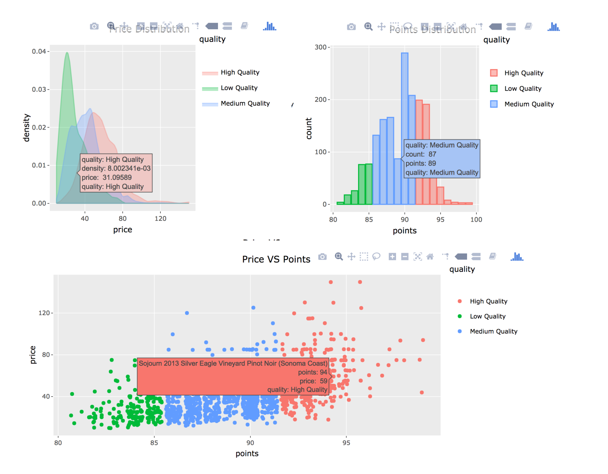

# Function & Design Choices

## App Overview

>The image above shows the one tab of our app. On the landing page, we have four filter options (drop down) and three quality options (check box) on the left. We have three interactive functionality plots on right. We have make the default input of country and province as 'Canada' and 'British Columbia', so the app enables users to see the wines' information relative to this country and province after the first tab. 

## Add Region and Variety selection and more locations

> The image above shows that the app enables the users to select regions and varieties based on their need. Users also have the choice to select more than one country and province. Users are able to see how the price and points distribution as well as the scatter plot changes after all their selections. 

## Explore Wines by Certain Qualities

> The above shows that users are allow to view the wines for certain quality levels. For example, this only shows the wines of low quality and high quality. 

## Interactive Features

> In our app, we render the plots with ploty so unsers are able to interact with the plots. The above images is to demonstrate what kind of information is shown when users interact with different plots. 

